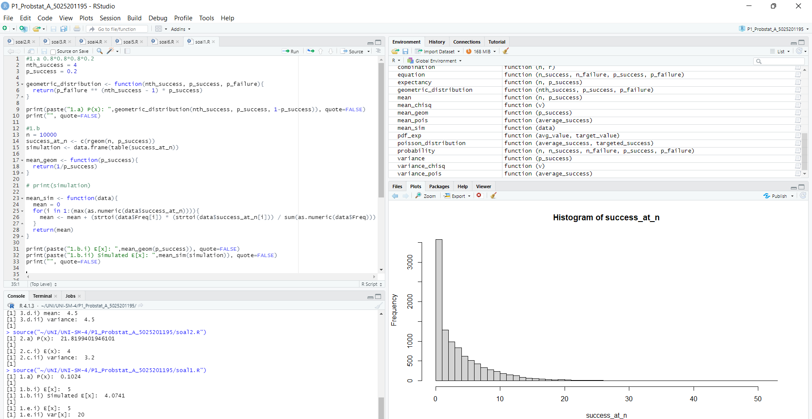
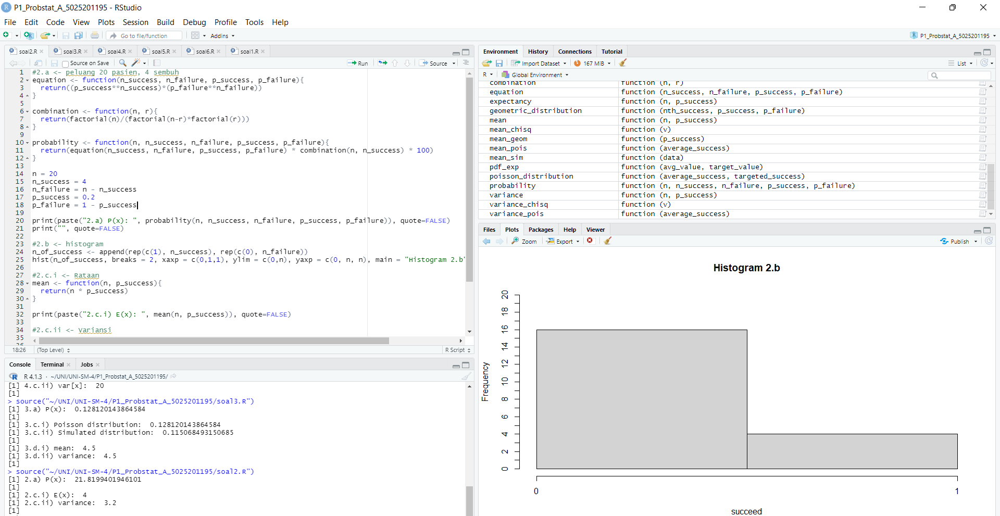
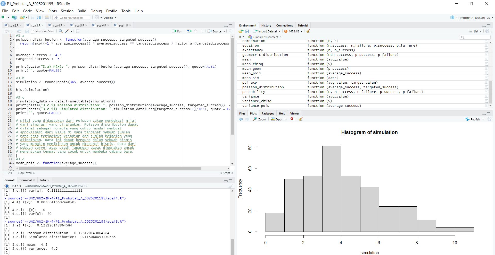
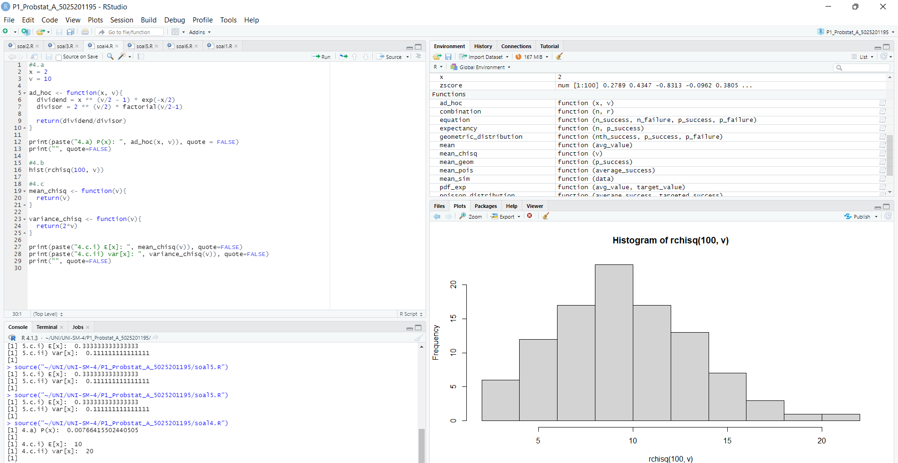
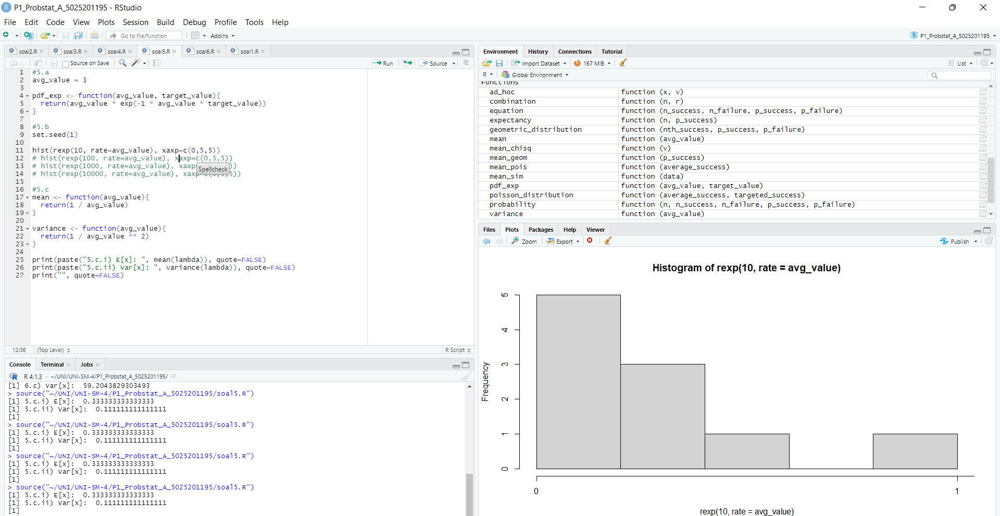
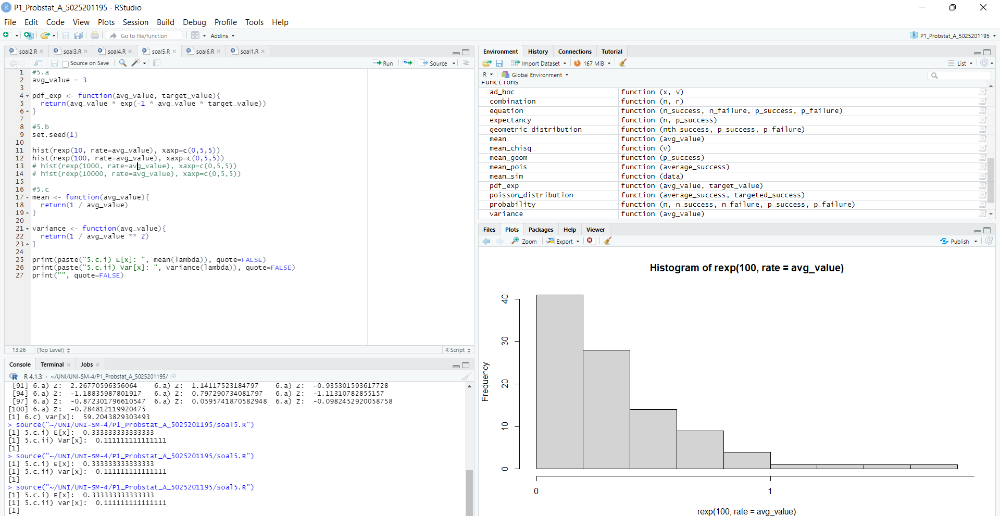
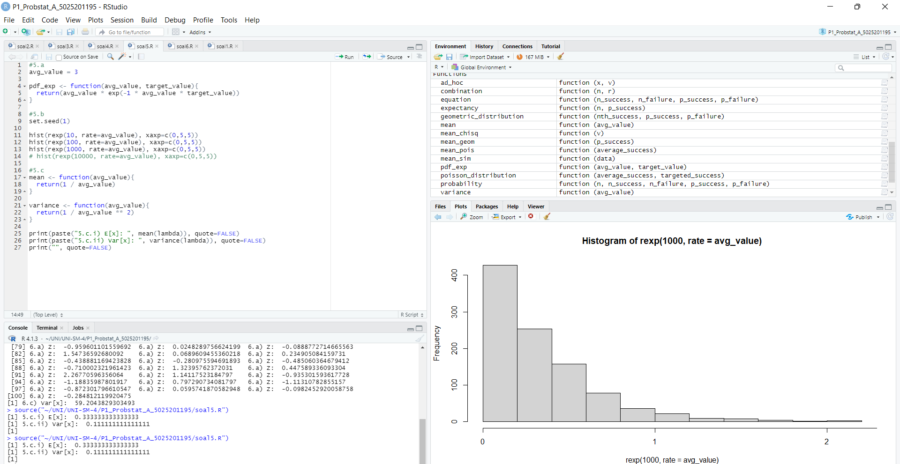
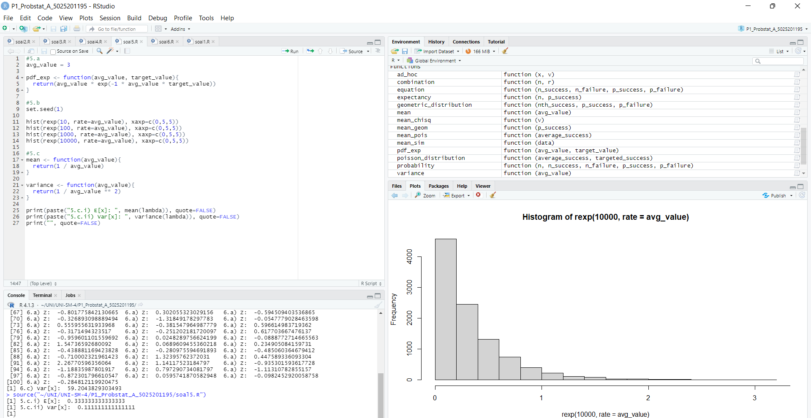
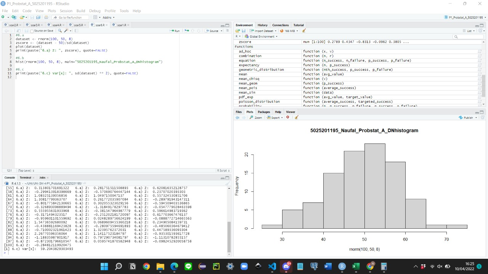

# Praktikum 1
Naufal Adli Purnama
5025201195
Probabilitas dan Statistika A

## [Daftar Isi](#praktikum-1)
+ [Soal 1](#soal-1)
+ [Soal 2](#soal-2)
+ [Soal 3](#soal-3)
+ [Soal 4](#soal-4)
+ [Soal 5](#soal-5)
+ [Soal 6](#soal-6)

## [Soal 1](#praktikum-1)
Seorang penyurvei secara acak memilih orang-orang di jalan sampai dia bertemu dengan
seseorang yang menghadiri acara vaksinasi sebelumnya.
+ `a.` Berapa peluang penyurvei bertemu `x = 3` orang yang tidak menghadiri acara vaksinasi sebelum keberhasilan pertama ketika `p = 0,20` dari populasi menghadiri acara vaksinasi (distribusi Geometrik)?
+ `b.` mean Distribusi Geometrik dengan 10000 data random, `prob = 0,20` dimana distribusi geometrik acak tersebut `X = 3` ( distribusi geometrik acak () == 3 )
+ `c.` Bandingkan Hasil poin a dan b , apa kesimpulan yang bisa didapatkan?
+ `d.` Histogram Distribusi Geometrik, Peluang `X = 3` gagal sebelum sukses pertama
+ `e.` Nilai Rataan (μ) dan Varian (σ²) dari Distribusi Geometrik.

## Penyelesaian
Soal tersebut diselesaikan dengan menggunakan rumus-rumus Distribusi Geometri, yaitu rumus:
    
  + Probability Density Function

    ^{n-1}(p))

  + Mean
    
    

  + Variance

    

### Source Code

```R
#1.a 0.8*0.8*0.8*0.2
nth_success = 4
p_success = 0.2

geometric_distribution <- function(nth_success, p_success, p_failure){
  return(p_failure ** (nth_success - 1) * p_success)
}

print(paste("1.a) P(x): ",geometric_distribution(nth_success, p_success, 1-p_success)), quote=FALSE)
print("", quote=FALSE)

#1.b
n = 10000
success_at_n <- c(rgeom(n, p_success))
simulation <- data.frame(table(success_at_n))

mean_geom <- function(p_success){
  return(1/p_success)
}

# print(simulation)

mean_sim <- function(data){
  mean = 0
  for(i in 1:(max(as.numeric(data$success_at_n)))){
    mean <- mean + (strtoi(data$Freq[i]) * (strtoi(data$success_at_n[i])) / sum(as.numeric(data$Freq)))
  }
  return(mean)
}

print(paste("1.b.i) E[x]: ",mean_geom(p_success)), quote=FALSE)
print(paste("1.b.ii) Simulated E[x]: ",mean_sim(simulation)), quote=FALSE)
print("", quote=FALSE)


# #1.c
# Setelah menjalankan program beberapa kali, pola yang ditemukan adalah
# nilai E(x) dari simulasi cenderung mendekati 4. Selain itu, dicoba juga
# variasi dengan mengubah peluang sukses dan pola yang ditemukan adalah nilai
# E(x) yang dihasilkan simulasi cenderung mendekati nilai E(x) - 1.

#1.d
hist(success_at_n, breaks=max(success_at_n))

#1.e
variance <- function(p_success){
  return((1-p_success)/p_success ** 2)
}

print(paste("1.e.i) E[x]: ", mean_geom(p_success)), quote=FALSE)
print(paste("1.e.ii) Var[x]: ", variance(p_success)), quote=FALSE)

```

### Dokumentasi
 *output soal 1*

<hr>

## [Soal 2](#praktikum-1)
Terdapat 20 pasien menderita Covid19 dengan peluang sembuh sebesar 0.2. Tentukan :
+ `a.` Peluang terdapat 4 pasien yang sembuh.
+ `b.` Gambarkan grafik histogram berdasarkan kasus tersebut.
+ `c.` Nilai Rataan (μ) dan Varian (σ²) dari Distribusi Binomial.
  
## Penyelesaian
Soal tersebut diselesaikan dengan menggunakan rumus-rumus Distribusi Binomial, yaitu rumus:
    
  + Probability Density Function

    ^{x}(1-p)^{n-x})

  + Mean
    
    

  + Variance

    

### Source Code
```R
#2.a <- peluang 20 pasien, 4 sembuh
equation <- function(n_success, n_failure, p_success, p_failure){
  return((p_success**n_success)*(p_failure**n_failure))
}

combination <- function(n, r){
  return(factorial(n)/(factorial(n-r)*factorial(r)))
}

probability <- function(n, n_success, n_failure, p_success, p_failure){
  return(equation(n_success, n_failure, p_success, p_failure) * combination(n, n_success) * 100)
}

n = 20
n_success = 4
n_failure = n - n_success
p_success = 0.2
p_failure = 1 - p_success

print(paste("2.a) P(x): ", probability(n, n_success, n_failure, p_success, p_failure)), quote=FALSE)
print("", quote=FALSE)

#2.b <- histogram
n_of_success <- append(rep(c(1), n_success), rep(c(0), n_failure))
hist(n_of_success, breaks = 2, xaxp = c(0,1,1), ylim = c(0,n), yaxp = c(0, n, n), main = "Histogram 2.b", xlab = "succeed")

#2.c.i <- Rataan
mean <- function(n, p_success){
  return(n * p_success)
}

print(paste("2.c.i) E(x): ", mean(n, p_success)), quote=FALSE)

#2.c.ii <- Variansi

variance <- function(n, p_success){
  return(n * p_success * (1 - p_success))
}

print(paste("2.c.ii) variance: ",variance(n, p_success)), quote=FALSE)
print("", quote=FALSE)

```
### Dokumentasi
 *output soal 2*

<hr>

## [Soal 3](#praktikum-1)
Diketahui data dari sebuah tempat bersalin di rumah sakit tertentu menunjukkan rata-rata historis
4,5 bayi lahir di rumah sakit ini setiap hari. (gunakan Distribusi Poisson)
+ `a.` Berapa peluang bahwa 6 bayi akan lahir di rumah sakit ini besok?
+ `b.` simulasikan dan buatlah histogram kelahiran 6 + bayi akan lahir di rumah sakit ini selama setahun `(n = 365)`
+ `c.` dan bandingkan hasil poin a dan b , Apa kesimpulan yang bisa didapatkan
+ `d.` Nilai Rataan (μ) dan Varian (σ²) dari Distribusi Poisson.

## Penyelesaian
Soal tersebut diselesaikan dengan menggunakan rumus-rumus Distribusi Geometri, yaitu rumus:
    
  + Probability Density Function

    

  + Mean
    
    

  + Variance

    

### Source Code
```R
#3.a
poisson_distribution <- function(average_success, targeted_success){
  return(exp((-1 * average_success)) * average_success ** targeted_success / factorial(targeted_success))
}

average_success <- 4.5
targeted_success <- 6

print(paste("3.a) P(x): ", poisson_distribution(average_success, targeted_success)), quote=FALSE)
print("", quote=FALSE)

#3.b
simulation <- round(rpois(365, average_success))

hist(simulation)

#3.c
simulation_data <- data.frame(table(simulation))
print(paste("3.c.i) Poisson distribution: ", poisson_distribution(average_success, targeted_success)), quote = FALSE)
print(paste("3.c.ii) Simulated distribution: ",simulation_data$Freq[targeted_success+1]/365), quote = FALSE)
print("", quote=FALSE)

# Nilai yang didapatkan dari Poisson cukup mendekati nilai
# dari simulasi yang dijalankan. Poisson distribution dapat 
# dilihat sebagai formula yang cukup handal membuat 
# aproksimasi dari kasus di mana terdapat sebuah jumlah 
# rata-rata terjadinya kejadian dan jumlah kejadian yang 
# diinginkan. Data ini dapat berguna dalam sebuah bisnis
# yang mungkin memikirkan untuk ekspansi bisnis. Data dari
# sebuah survei atau studi lapangan dapat digunakan untuk 
# menentukan tempat yang cocok untuk membuka cabang baru.

#3.d
mean_pois <- function(average_success){
  return(average_success)
}

variance_pois <- function(average_success){
  return(average_success)
}

print(paste("3.d.i) mean: ",mean_pois(average_success)), quote=FALSE)
print(paste("3.d.ii) variance: ",variance_pois(average_success)),quote=FALSE)
print("", quote=FALSE)
```
### Dokumentasi
 *output soal 3*

<hr>

## [Soal 4](#praktikum-1)
Diketahui nilai `x = 2` dan `v = 10`. Tentukan:
+ `a.` Fungsi Probabilitas dari Distribusi Chi-Square.
+ `b.` Histogram dari Distribusi Chi-Square dengan 100 data random.
+ `c.` Nilai Rataan (μ) dan Varian (σ²) dari DistribusiChi-Square.

## Penyelesaian
Soal tersebut diselesaikan dengan menggunakan rumus-rumus Distribusi Chi-Square, yaitu rumus:
    
  + Probability Density Function

    })

  + Mean
    
    

  + Variance

    

### Source Code
```R
#4.a
x = 2
v = 10

ad_hoc <- function(x, v){
  dividend = x ** (v/2 - 1) * exp(-x/2)
  divisor = 2 ** (v/2) * factorial(v/2-1)
  
  return(dividend/divisor)
}

print(paste("4.a) P(x): ", ad_hoc(x, v)), quote = FALSE)
print("", quote=FALSE)

#4.b
hist(rchisq(100, v))

#4.c
mean_chisq <- function(v){
  return(v) 
}

variance_chisq <- function(v){
  return(2*v)
}

print(paste("4.c.i) E[x]: ", mean_chisq(v)), quote=FALSE)
print(paste("4.c.ii) var[x]: ", variance_chisq(v)), quote=FALSE)
print("", quote=FALSE)
```
### Dokumentasi
 *output soal 4*

<hr>

## [Soal 5](#praktikum-1)
Diketahui bilangan acak (random variable) berdistribusi exponential `(λ = 3)`. Tentukan
+ `a.` Fungsi Probabilitas dari Distribusi Exponensial
+ `b.` Histogram dari Distribusi Exponensial untuk 10, 100, 1000 dan 10000 bilangan random
+ `c.` Nilai Rataan (μ) dan Varian (σ²) dari Distribusi Exponensial untuk `n = 100` dan `λ = 3`
Petunjuk:
  + Gunakan `set.seed(1)`
  + Gunakan fungsi bawaan R

## Penyelesaian
Soal tersebut diselesaikan dengan menggunakan rumus-rumus Distribusi Eksponensial, yaitu rumus:
    
  + Probability Density Function

    

  + Mean
    
    

  + Variance

    

### Source Code
```R
#5.a
avg_value = 3

pdf_exp <- function(avg_value, target_value){
  return(avg_value * exp(-1 * avg_value * target_value))
}

#5.b
set.seed(1)

# hist(rexp(10, rate=avg_value), xaxp=c(0,5,5))
# hist(rexp(100, rate=avg_value), xaxp=c(0,5,5))
# hist(rexp(1000, rate=avg_value), xaxp=c(0,5,5))
# hist(rexp(10000, rate=avg_value), xaxp=c(0,5,5))

#5.c
mean <- function(avg_value){
  return(1 / avg_value)
}

variance <- function(avg_value){
  return(1 / avg_value ** 2)
}

print(paste("5.c.i) E[x]: ", mean(lambda)), quote=FALSE)
print(paste("5.c.ii) Var[x]: ", variance(lambda)), quote=FALSE)
print("", quote=FALSE)
```
### Dokumentasi
 *output soal 5 histogram n=10*

 *output soal 5 histogram n=100*

 *output soal 5 histogram n=1000*

 *output soal 5 histogram n=10000*

<hr>

## [Soal 6](#praktikum-1)
Diketahui generate random nilai sebanyak 100 data, mean = 50, sd = 8. Tentukan
+ `a.` Fungsi Probabilitas dari Distribusi Normal P(X1 ≤ x ≤ X2), hitung Z-Score Nya dan plot
data generate randomnya dalam bentuk grafik. Petunjuk(gunakan fungsi plot()).

    Keterangan :

        X1 = Dibawah rata-rata

        X2 = Diatas rata-rata

    Contoh data :

        11

        1,2,4,2,6,3,10,11,5,3,6,8

        rata-rata = 5.083333

        X1 = 5

        X2 = 6

+ `b.` Generate Histogram dari Distribusi Normal dengan breaks 50 dan format penamaan:
__NRP_Nama_Probstat_{Nama Kelas}_DNhistogram__
Contoh :
312312312_Rola_Probstat_A_DNhistogram
+ `c.` Nilai Varian (σ²) dari hasil generate random nilai Distribusi Normal

## Penyelesaian
Soal tersebut diselesaikan dengan menggunakan rumus-rumus Distribusi Normal, yaitu rumus:
    
  + Z-Score

    

  + Variance

    

### Source Code
```R
#6.a
dataset <- rnorm(100, 50, 8)
zscore <- (dataset - 50)/sd(dataset)
plot(dataset)
print(paste("6.a) Z: ", zscore), quote=FALSE)

#6.b
hist(rnorm(100, 50, 8), main="5025201195_Naufal_Probstat_A_DNhistogram")

#6.c
print(paste("6.c) Var[x]: ", sd(dataset) ** 2), quote=FALSE)

```
### Dokumentasi
 *output soal 6*
